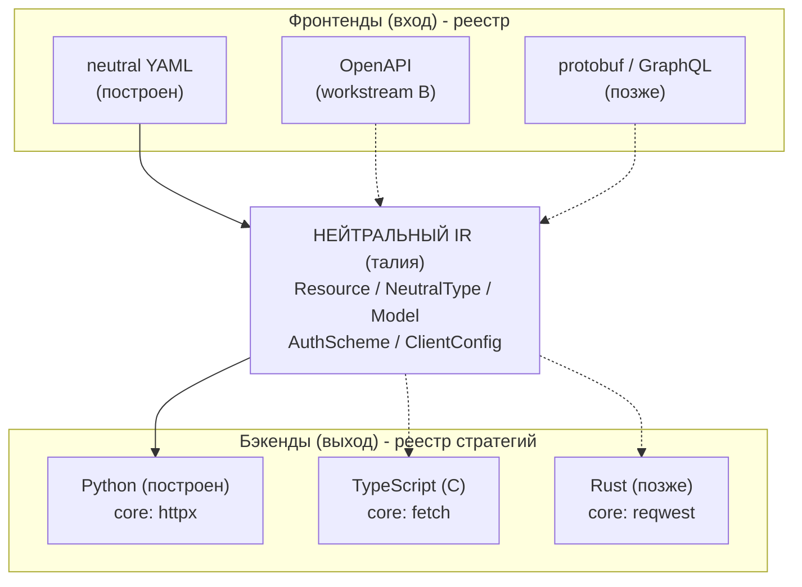
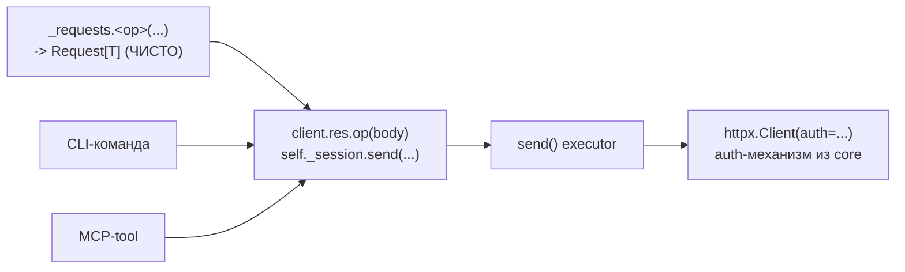
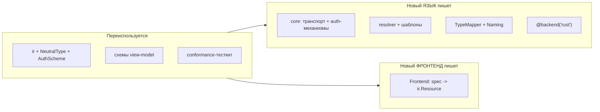
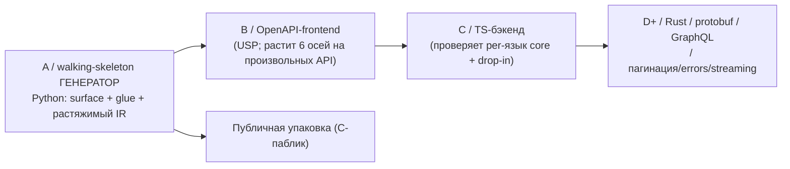

# refract - редизайн архитектуры генератора (Workstream A)

- **Дата:** 2026-07-14 / **ревизия:** 2026-07-17 (после валидации на 15 публичных API)
- **Статус:** дизайн согласован; план реализации переписывается под эту ревизию
- **Ветка:** `feat/me-walking-skeleton`
- **Тип:** design spec (рабочий процессный документ; публичные англоязычные доки - Workstream C)

---

## 1. Резюме и цель

refract - **публичный** язык-агностичный спек-driven генератор: спека API -> нейтральный IR -> подключаемые бэкенды, дающие на каждую пару (язык x surface) типизированный HTTP-клиент, CLI, MCP-сервер, модели и тесты. Это **не ad-hoc тул под один API**: цель - генерить SDK для произвольного API. Python - первый бэкенд; TypeScript/Rust - drop-in. ycli (Yandex Tracker) - первый потребитель и walking skeleton.

Текущий код рабочий, но процедурный: строковая сборка в эмиттерах, `_common.py` с глобалом, god-file `loader.py`, хардкод целевого пакета, «пролоуренные» Python-типы в IR, плоский `tests/`, `argparse`/`dataclass`/хардкод версии. Сверх того IR **игрушечный**: не моделирует auth, серверы, ошибки, кодирование тела, пагинацию - то, на чём живут реальные API (разд. 6).

**Цель Workstream A** - заменить это декларативной, композиционной, мультиязык-готовой архитектурой и **доказать её сквозным walking-skeleton генератором**: из нейтральной спеки получаем рабочий Python SDK + CLI + MCP + тесты **вместе с glue** (root-client, auth-обвязка), при этом:
- форма вывода - **вариант D** (sans-I/O `Request` + общий `send()`), а не текущий uplink;
- каждая варьирующаяся ось - внедряемая стратегия либо **растяжимый union** в IR;
- добавить язык / фронтенд / auth-схему можно аддитивно (DX - требование первого класса, разд. 13);
- корректность гарантирует 4-слойный оракул (разд. 12).

Не входит: реальные TS/Rust-эмиттеры, OpenAPI-фронтенд, GraphQL, публичная упаковка (разд. 15).

---

## 2. Валидация дизайна (провенанс)

Дизайн проверен против Fern (`fern-api/fern`), Smithy (`smithy-lang/*`), OpenAPI-generator, Stainless/Speakeasy (публичные доки) и **свипа по 15 публичным API**: Stripe / Twilio / Plaid / Slack / SendGrid / GitHub / GitLab / Jira Cloud / Discord / Linear / AWS S3 / Cloudflare / OpenAI / Notion / Shopify Admin.

| Тезис | Свидетельство |
|---|---|
| Нейтральный IR - «талия» песочных часов | Fern IR (versioned, `@fern-api/ir-sdk`); Smithy `Model` (in-memory); OAG `CodegenModel`/`CodegenOperation` |
| Транспорт-движок = **рукописная per-language runtime-lib**; генерится только тонкая поверхность + обвязка | Fern vendor'ит `core/` (httpx) в каждый SDK; Smithy публикует `@smithy/*` и `aws-smithy-*`; Stainless vendor'ит core (`httpx`+`pydantic`) |
| root-client + auth-обвязка **генерируются** (иначе тул не публичный) | Fern генерит root client + `environments`; Stainless `client_settings` / `environments` / `security` |
| auth = закрытый набор механизмов (scheme-id + identity + signer) + custom-hook | Smithy `@authDefinition` + per-lang auth-scheme SPI; Speakeasy `x-speakeasy-custom-security-scheme` + `BeforeRequestHook`; Stainless `x-stainless-auth` |
| `httpx.Auth` - **трансформер запроса**, а не хедер-инжектор: SigV4 ложится в core | httpx `auth_flow` + `requires_request_body=True`; botocore `SigV4Auth.add_auth()` мутирует собранный `AWSRequest` |
| REST-first; GraphQL - отдельный frontend+backend pair | Linear (GraphQL-only) ломает REST-модель; Fern так же держит gRPC вторым классом (SDK только C#) |
| Input-адаптеры - то, чем refract обгоняет Smithy | у Smithy **нет** ингеста OpenAPI и нет SPI для входных форматов (`smithy-translate` - сторонний проект) |

Полные вердикты свипа - разд. 6.

---

## 3. Зафиксированные решения

| # | Решение | Выбор | Почему |
|---|---|---|---|
| 1 | Форма вывода клиента | **D**: sans-I/O `Request<T>`-билдеры + один `send()`-executor | форма AWS SDK v3 / Smithy; структурно одинакова в Python/TS/Rust; убирает Python-костыль `_verb`/`verb` |
| 2 | Транспорт | отказ от `uplink`; тонкий executor поверх `httpx` | uplink - только Python (нет аналога в TS/Rust) |
| 3 | Механизм рендеринга | Jinja-листья + типизированный view-model | ветвление - в типизированном Python; Jinja только раскладывает; whitespace снимает `ruff` |
| 4 | Представление IR | frozen pydantic v2; коллекции - `tuple` | иммутабельность + порядок рендера (не ради хеша, см. разд. 5) |
| 5 | Нейтральные типы | `NeutralType`-сумма в IR; лоуринг - в `TypeMapper` | исправляет утечку Python-строк в IR |
| 6 | Объектная модель | композиция стратегий, без mixins | mixins прячут зависимости в общий `self`, не подменяются, впекают язык |
| 7 | Оракул | 4 слоя (L0 юниты / L1 снапшоты / L2 миграционный / L3 поведенческий) | 100%-гейт на блоб тавтологичен |
| 8 | Граница мультиязыка | нейтральный IR **в процессе**; версионируемый артефакт - не строим | YAGNI: Fern версионирует IR из-за внешних процессов-генераторов; у нас in-process бэкенд |
| 9 | CLI генератора | **Typer** (Annotated) | современный идиом; sub-команды |
| 10 | Версия пакета | `importlib.metadata.version("refract")` | не хардкодить |
| 11 | Форматтер | `ruff` через subprocess, обёрнут в `Formatter` | у ruff нет Python-API; два прохода (import-sort + format) |
| 12 | Layout | `src/`-layout; `tests/` зеркалит `src/refract/` | PyPA best-practice |
| 13 | Rename-хук на surface | опциональное поле в IR, пока незаполненное | raw operationId корявы (все конкуренты добавляют) |
| **14** | **op-shape (`OpShape`/`classify`/`shapes.py`)** | **удалён** | ровно 2 потребителя, различие = один bool `op.body is not None`, `TypedWrite.body` производный, а 3 из 5 surface его игнорили. Shape-сумму вернём, когда придёт пагинация/LRO - под реальные требования, а не спекулятивно |
| **15** | **`Model`** | **discriminated union** `ObjectModel \| RootListModel` | `item` только у root_list, `fields` только у object -> нелегальные состояния непредставимы; консистентно с `NeutralType`; попутно удалён мёртвый `config` (0 инстансов, 0 читателей) |
| **16** | **Замкнутые строковые множества** | `StrEnum` для именованных категорий (`Safety`), `Literal` для дискриминаторов и одиночных значений | pydantic **требует** `Literal[...]` для `discriminator=`; `Literal` - леанее по умолчанию, `StrEnum` - когда нужен импортируемый namespace |
| **17** | **`Body.dump`** | **нейтрализован** -> `by_alias` / `omit_none` флаги | держал лоуренный Python (`"by_alias=True, exclude_none=True"`) в «нейтральном» IR - та же утечка, что решение #5 убирает для типов |
| **18** | **Граница «руками vs генерим»** | core (транспорт / auth-механизмы / итераторы / энкодеры) - **руками, 1 раз на язык**; типизированная поверхность **+ glue** - **генерим** | подтверждено Fern/Smithy/Stainless; для публичного тула glue нельзя писать руками - API произвольный |
| **19** | **auth** | `AuthScheme`-union: дескрипторы + built-in механизмы + custom-hook; механизм = `httpx.Auth` в core | SigV4 верифицирован против botocore+httpx: «auth = хедер-шаблон» - ложно |
| **20** | **Оси разнообразия** | оформлены как растяжимые union'ы; **строим только срез walking skeleton** | rule-of-three: каждую ось растит реальный API + byte-target, не спекуляция |
| **21** | **GraphQL** | вне scope; отдельный frontend+backend pair | Linear (GraphQL-only) BREAKS REST-модель: один endpoint, query-документ, переменные, `errors[]` в 200 |
| **22** | **`SurfaceEmitter.name`** | остаётся `str` (+ юнит-тест связи `name`<->`Layout`) | диспатч = реестр классов + `applies()`, а не сравнение имени; surface - ось расширения, закрытый enum лгал бы |
| **23** | **Конфиг API** | единый **`client.yaml`** на API (server + default_headers + auth); `_auth.yaml` в него мигрирует | как Stainless `stainless.yml`; `base_url` переезжает с `Resource` на `ClientConfig` (он per-API, не per-resource) |

---

## 4. Архитектура: песочные часы



### Три слоя (кто что пишет)

| Слой | Что | Кто | Зависит от API? |
|---|---|---|---|
| **1 / Core** (runtime-lib) | `Request` / `Session.send` / retry-движок / **библиотека auth-механизмов** (`httpx.Auth`) / body-энкодеры / pagination-итераторы / custom-hook | **руками, 1 раз на язык** (refract даёт reference; ycli адаптирует) | **НЕТ** |
| **2 / Typed surface** | `models` / `_requests` / `client` / `cli` / `mcp` / `tests` | **генерит refract** (per-resource) | да |
| **3 / Glue** | **root-client** / server/base-url / auth-selection / default-headers | **генерит refract** (per-API) | да |

Слой 1 - это и есть «захардкодить 1 раз на язык, чтобы умело работать с нашим контрактом `Request`». Слои 2-3 генерятся: для произвольного API их нельзя писать руками.

---

## 5. Нейтральный IR

- `ir/types.py`: `NeutralType = ScalarType | RefType | ListType | MapType` - замкнутая, frozen, hashable сумма; диспатч исчерпывающий (`match` + `assert_never`).
- `ir/model.py`: `Resource / Model / Field / Param / Operation / Body / McpMeta / CliMeta / TestCase / ModuleDocs` - frozen pydantic v2, коллекции `tuple[...]`.
- `ir/auth.py`: `AuthScheme`-union + `AuthInput`.
- `ir/client.py`: `ClientConfig` (server / default_headers / auth-схемы), `Server`.
- `spec/`: pydantic-схема входа (`extra="forbid"`), декомпозиция god-file; **neutral-YAML - первый Frontend** (см. разд. 13).

**Инвариант иммутабельности (важное уточнение).** IR везде frozen. Hashability гарантируется только для `NeutralType` (мелкие узлы); большие узлы (`Resource`/`Operation`/`TestCase`) уже нехешируемы из-за JSON-фикстуры в `response_json`. Поэтому `tuple` держим **ради иммутабельности и порядка рендера**, а не ради хеша; `dict` дал бы глубокую мутабельность и ни одного lookup'а (их в коде нет - `fields`/`models` только итерируются).

---

## 6. Оси разнообразия (что свип показал и что мы строим)

Свип по 15 API: hourglass **выживает**, REST + стандартный auth - COVERED. STRAINS кластеризуются на шести осях, которых игрушечный IR не знает. Оформляем каждую как **растяжимый union**, строим **только срез walking skeleton**.

| Ось | Реальность (кто требует) | Построено в A | Названо (растёт по rule-of-three) |
|---|---|---|---|
| **auth** | bearer (Stripe/Slack/SendGrid/OpenAI/Notion) / basic (Twilio/Jira: email+token) / apikey-header (Shopify `X-Shopify-Access-Token`) / **multi-header** (Cloudflare `X-Auth-Email`+`X-Auth-Key`; **Yandex** `OAuth`+`X-Org-Id`) / префиксы (`Bot ` Discord, пустой Linear) / **sigv4** (AWS) / token-minting (GitHub App JWT->installation) | `HeaderAuth`, `MultiHeaderAuth` (= Yandex) | `Bearer`, `Basic`, `ApiKeyQuery`, `SigV4`(built-in механизм), `OAuth2Refresh`(stateful), `CustomHook` |
| **server** | фикс+path-ver (OpenAI/Notion/Cloudflare/Discord) / **template с переменными** (`{shop}.myshopify.com`, `s3.{region}`, `{site}.atlassian.net`) / self-host (GHES, GitLab) / мульти-хост (Stripe `connect`/`files`; Twilio per-product+edge) | `FixedServer` | `TemplatedServer(variables)`, `MultiServer`, per-op override |
| **errors** | envelope+status (Stripe/Twilio/SendGrid/Cloudflare/Notion/OpenAI) / **body-дискриминатор** (Slack `{ok:false}`@200; Plaid `error_code` - доки прямо велят читать body, не статус) / XML (S3) | status-only (срез) | `BodyDiscriminatedError(field)`, `XmlError` |
| **body encoding** | JSON (Plaid/SendGrid/Stripe v2/OpenAI) / **form-urlencoded + bracket-arrays** (Stripe v1 `a[b][]`, Twilio, Slack) / multipart (OpenAI files, S3) | `json` (срез) | `Form(bracket-arrays)`, `Multipart` |
| **pagination** | cursor-query (Stripe/Slack/OpenAI/Notion) / cursor-в-body (Plaid sync) / offset (GitLab/Jira/SendGrid) / **Link-header** (GitHub/GitLab/SendGrid/Shopify) / follow-absolute-next-URL (Twilio) / snowflake-id (Discord) / continuation-token (S3) | нет (у me/priorities её нет) | `Cursor`, `OffsetPage`, `LinkHeader`, `FollowNextUrl`, `CursorInBody` - итераторы в core, per-op tag в IR |
| **default headers** | required const (`Notion-Version` - без него `missing_version`) / optional (`OpenAI-Organization`, `Stripe-Version`, `Plaid-Version`) - **это НЕ auth** | `default_headers` (const+optional) | - |

**Два верифицированных факта, которые формируют auth:**
1. SigV4 **не ломает** `httpx.Auth`-в-core: `auth_flow` - трансформер запроса, `requires_request_body=True` буферит body до подписи (ровно как `botocore.SigV4Auth`). Подпись живёт **после** сериализации `Request[T]` в `httpx.Request` - чистый value-объект не трогаем.
2. Но SigV4 **ломает** «auth = хедер-шаблон»: это `f(method, path, sorted-query, signed-headers, body-sha256, region, service, timestamp)`. Значит auth = закрытый набор **named built-in механизмов** (код в core) + **дескрипторы** (данные) + **custom-hook**, а не один шаблон.

**За границей (осознанно):** GraphQL (Linear BREAKS; GitHub/GitLab/Shopify - вторая поверхность) -> отдельный frontend+backend pair. Runtime-resolved base-url (Jira 3LO `cloudId` через bootstrap-запрос) и token-minting (GitHub App) -> stateful механизм / hook, позже. S3 virtual-hosted (bucket в authority + подписан) -> дефолт path-style. Верификация webhook-подписей (Stripe HMAC-SHA256, Twilio HMAC-SHA1, Slack v0, SendGrid ECDSA, Discord Ed25519) - **inbound**, вне outbound-клиента; кандидат в отдельные generated verify-utils.

---

## 7. Контракт плагина: 5 стратегий (`emitters/api.py`)

| Стратегия | Ответственность | Python-реализация |
|---|---|---|
| `Naming` | кейсы идентификаторов + защита от shadowing | `PythonNaming` (заменяет `_common.py`; `_SHADOWED_NAMES` -> состояние экземпляра; три `*_class` -> один `class_name(base, suffix)`) |
| `TypeMapper` | `NeutralType` -> тип языка + null-дефолт | `PythonTypeMapper` (сюда уезжает `loader._lower_type`, `match`+`assert_never`) |
| `Formatter` | post-emit форматирование | `RuffFormatter` (два прохода: `check --select I --fix`, затем `format`) |
| `Docstrings` | блок док/комментов на отступе | `PythonDocstrings` |
| `Layout` | `(resource, surface) -> путь файла` | `PythonLayout` |

Плюс value-объекты `RenderedType`, `Import`, `Fragment(lines, imports)`, `EmitContext(package_root)`; `SurfaceEmitter` (`name: str` / `applies(res)` / `emit(res, ctx)`); `LanguageBackend` - frozen-композиция 5 стратегий + surfaces, регистрируется `@backend("python")`; `registry.get_backend(name)` - ленивый импорт.

`UnitRenderer` (на операцию) -> `Fragment`; `ResourceAssembler` (на ресурс) - рамка модуля + **единственная** ответственность сбора импортов. `Generator` - язык-агностичный оркестратор; никогда не называет surface напрямую.

**Почему не mixins:** прячут зависимости в общий `self`; не регистрируются/не подменяются; впекают Python в идентичность эмиттера; не тестируются в изоляции; `super()`/ромбы MRO хрупки.

---

## 8. Форма вывода D (Request + send)

Каждая операция компилируется в **чистую функцию-билдер**, возвращающую `Request[T]` (метод, путь, query/body, тип ответа - без I/O). Один `send()`-executor исполняет любой `Request`. Тонкий класс-сахар даёт публичный `client.res.op(body)`.



| Surface | Что эмитим |
|---|---|
| `_requests` | одна чистая функция на операцию -> `Request[ResponseModel]` (единственное место HTTP-контракта) |
| `client` | тонкий класс-сахар: `self._session.send(_requests.<op>(...))` |
| `cli` / `mcp` | зовут сахар клиента (**F2 client-mediated**) - одна кодовая тропа, дрейф невозможен |
| `models` | pydantic |
| `tests` | стаб-HTTP на все surface |
| **`root_client`** | **новое:** aggregator ресурсов + сборка `Session`/`httpx.Client` + auth-схема + default-headers |

**Инвариант транспорта:** sans-I/O confinement - функции `_requests` чистые, I/O только в `send()`. Строже старого ARCH-2 и одинаково во всех языках.

Ветвление read/write - локальное (`if op.body is not None`), без параллельной иерархии (решение #14).

---

## 9. Слой 1 / Core (reference runtime)

refract **ставит** reference-core (для L3 и как эталон, который ycli адаптирует). Сгенерированный код тянет аналог из `{package_root}` (`EmitContext.package_root`, дефолт `ycli.yandex.{domain}` - раз-хардкодит «ycli»).

Содержимое core (API-agnostic, руками, 1 раз на язык):
- `runtime/request.py` - `Request[T]` (frozen, generic): method / path / response_model / query / json_body.
- `runtime/session.py` - `Session.send(request)`: base_url, дроп `None`-query, `raise_for_status`, `model_validate`. **Auth-agnostic**: держит уже сконфигурированный `httpx.Client`.
- `runtime/auth.py` - **библиотека механизмов** на `httpx.Auth`: `HeaderAuth`, `MultiHeaderAuth` (построены); `BearerAuth`/`BasicAuth`/`SigV4Auth`/`OAuth2RefreshAuth` - растут по rule-of-three; `AuthHook`-интерфейс (`BeforeRequest`) - универсальный escape под кастом.

> Уточнение формулировки (было неверно): auth принадлежит **клиенту**, а не `send()`. Композиционный корень строит `httpx.Client(auth=<механизм>)`; `Session` его только держит. Это идиома httpx (auth - свойство долгоживущего Client) и она же делает `Request[T]` навсегда чистым.

Полноценные ретраи / маппинг ошибок / итераторы пагинации / body-энкодеры - растут в core по мере осей (разд. 6).

---

## 10. Слой 3 / Генерируемый glue (`client.yaml`)

Единый конфиг на API (мигрирует `_auth.yaml`; `base_url` уезжает с `Resource`):

```yaml
name: tracker
server:
  base_url: https://api.tracker.yandex.net/v3
default_headers: {}
auth:
  oauth_token:
    kind: multi_header
    headers: {Authorization: "OAuth {token}", X-Org-Id: "{organization_id}"}
    inputs:
      token: {env: YANDEX_ID_OAUTH_TOKEN}
      organization_id: {env: YANDEX_ID_ORGANIZATION_ID}
```

`resource.yaml` сохраняет `security: oauth_token` - ссылка на схему по имени (поле оживает; сейчас оно мёртвое).

Из этого генерится **root-client**: конструктор с параметрами-инпутами (`oauth_token`, `organization_id`), сборка механизма из core + `httpx.Client(auth=...)` + `Session`, агрегация ресурсов (`.me`, `.priorities`), default-headers. Секреты: `inputs.env` объявляет источник; **чтение env - только в сгенерированном composition-root** (единственная санкционированная точка, консистентно с DI-правилом «env читается в одном корне»), сам механизм env не трогает.

---

## 11. Слой рендеринга (view-model + Jinja)

- View-model (`emitters/python/views.py`): frozen pydantic; **каждое поле - резолвнутый примитив**, ни одного `ir`-объекта. Шаблон не может принимать решений.
- Resolver (`resolve.py`): `IR -> view-model`; типизированная плоская логика; тестируется **без рендера**.
- Jinja `Environment`: `autoescape=False`, `trim_blocks`, `lstrip_blocks`, `keep_trailing_newline`, `StrictUndefined`, `PackageLoader`. Наследование (`_module` база + блоки) + макросы.
- Единственные `` - презентационные, не форма операции.

Честная цена: макрос `signature` - самый мудрёный артефакт; блок-отступ ruff не чинит (дисциплина: одна логическая строка тела + константный префикс). Выбор Jinja обратим - несущее здесь view-model.

---

## 12. Оракул корректности (4 слоя)

| Слой | Что | Роль | В быстром гейте |
|---|---|---|---|
| L0 | юниты (`TypeMapper`, `Naming`, resolver -> view-model, сбор импортов, auth-резолв) | костяк покрытия | да |
| L1 | регенерируемые снапшоты собственного вывода (`--update-snapshots`) | сеть регрессий по всем surface | да |
| L2 | byte-identical vs реальный ycli | оракул миграции; **отложен** (D-стиля ycli не существует), пересобирается при миграции | да (когда появится) |
| L3 | поведенческий: импорт + `ty` + `ruff` + эмитируемый pytest на stubbed HTTP | единственный доказывающий, что вывод **работает** | нет (opt-in) |

Выбрав D, мы аннулировали старые uplink-goldens -> сеть = L0+L1+L3. **Стратегический бонус:** у Fern N рукописных language-core'ов не имеют общего кода - общий только IR. Наш кросс-язык рычаг - **conformance-тесткит поверх L3**, параметризованный по бэкендам: это то, чем можно обойти Fern.

`tests/` зеркалит `src/refract/`; `snapshots/` (L1), `conformance/` (L2), `behavioral/` (L3, `@pytest.mark.behavioral`).

---

## 13. DX / расширяемость



| Афорданс | Эффект |
|---|---|
| Контракт бэкенда в одном `emitters/api.py` | вся поверхность реализации читается за страницу |
| Реестр `@backend("rust")` + ленивый импорт | новый язык = директория + декоратор; ноль правок центральных файлов |
| **Шов `Frontend`** (`SpecLoader` = neutral-YAML фронтенд) | OpenAPI/protobuf - аддитивно (Fern: `AbstractConverter` -> один IR). У Smithy такого шва нет - это наше отличие |
| `AuthScheme`-union + `runtime/auth.py` | новая схема = вариант union + механизм в core; кастом = `httpx.Auth`-подкласс через hook |
| Conformance-тесткит по бэкендам | зарегистрировал -> бесплатный прогон фикстур |
| `docs/adding-a-language.md` | чек-лист: 5 интерфейсов -> шаблоны -> регистрация -> тесткит |
| `refract generate --update-snapshots` | правка шаблона не требует ручного редактирования ожиданий |
| Мелкие файлы + быстрый L0/L1-гейт + pre-commit | быстрый цикл PR |

---

## 14. Структура `src/` (целевая)

| Путь | Роль |
|---|---|
| `src/refract/__init__.py` | `__version__` из `importlib.metadata` |
| `src/refract/cli.py` | Typer-app; entry point `refract.cli:app` |
| `src/refract/generation.py` | `Generator`: resolve backend -> plan -> write -> check |
| `src/refract/spec/` | pydantic-схема входа; `loader.py` = `SpecLoader.load` (neutral-YAML **Frontend**) |
| `src/refract/ir/types.py` | `NeutralType`-сумма |
| `src/refract/ir/model.py` | frozen pydantic IR (`Model`-union, typed множества) |
| **`src/refract/ir/auth.py`** | **`AuthScheme`-union + `AuthInput`** |
| **`src/refract/ir/client.py`** | **`ClientConfig` + `Server`** |
| `src/refract/emitters/api.py` | контракт плагина |
| `src/refract/emitters/registry.py` | `@backend` + `get_backend` |
| `src/refract/emitters/python/{backend,naming,types,format,docstrings,layout}.py` | стратегии |
| `src/refract/emitters/python/{views,resolve,environment}.py` | view-model / resolver / Jinja env |
| `src/refract/emitters/python/surfaces/` | `requests / client / models / cli / mcp / tests / package` **+ `root_client`** |
| `src/refract/emitters/python/templates/` | `*.jinja` |
| `src/refract/runtime/{request,session}.py` | reference-core: `Request[T]` + `Session.send` |
| **`src/refract/runtime/auth.py`** | **библиотека auth-механизмов (`httpx.Auth`) + hook** |
| `tests/` | зеркалит `src/refract/`; `snapshots/` `conformance/` `behavioral/` |
| `artifacts/` | gitignored: перенесённый `docs/research/**` |
| `examples/` | golden-корпус + **`client.yaml`** |

Удаляется: `emitters/shapes.py` (решение #14), `emitters/python/_common.py`.

---

## 15. Границы: не-цели и отложенное

- Реальные TS/Rust-эмиттеры - **нет** (готовим drop-in; строим Python).
- OpenAPI/protobuf-фронтенды - **workstream B+** (шов назван сейчас).
- **GraphQL** - отдельный frontend+backend pair (решение #21).
- Невыстроенные варианты шести осей (разд. 6) - по rule-of-three, каждый с реальным API + byte-target.
- Версионируемый IR-артефакт + миграции (путь Fern) - отложено (появятся сторонние бэкенды).
- Runtime-resolved base-url (Jira 3LO), token-minting (GitHub App), streaming/SSE, XML, webhook-verify - отложено, шов известен.
- Публичная упаковка / релизы / README / CI / PyPI - **Workstream C**.

---

## 16. Roadmap воркстримов



| Воркстрим | Что |
|---|---|
| **A** (этот спек) | архитектура + Python walking-skeleton генератор: типизированный IR / D-форма / композиция стратегий / Jinja / **generated glue** / оракул / DX / src-layout |
| **B** | OpenAPI-фронтенд - упражняет рост IR по всем 6 осям на произвольных API |
| **C** | TS-бэкенд - проверяет, что core действительно per-язык, а бэкенд drop-in |
| **Backlog** | доп. auth-механизмы / pagination-зоопарк / body-encoding / error-дискриминаторы / templated/multi servers / streaming / GraphQL / webhook-verify |

---

## 17. Риски и снятие

| Риск | Снятие |
|---|---|
| Смена формы вывода (D) ломает старую byte-identity сеть | опора на L0+L1+L3; L2 пересобирается против D-стиля |
| Нужно переписать runtime-базу ycli | ограниченная однократная работа; публичный API SDK не меняется; пер-ресурсные файлы генерируются |
| Big-bang: `refract generate` сломан фазы 0..N | принятый трейдофф; гейт покрытия временно ослаблен и восстановлен в финальной фазе |
| Макрос `signature` / блок-отступ в Jinja | дисциплина + L1-снапшоты; выбор обратим |
| Разрастание view-model в «свалку строк» | правило: поле view-model - резолвнутый лист |
| **Спекулятивная генерализация 6 осей** | строим только срез walking skeleton; каждую ось растит реальный API + byte-target (решение #20) |
| **`Model`-union / typed-множества ломают loader+resolver+тесты** | big-bang уже переписывает эти места; изменения точечные и покрыты L0 |
